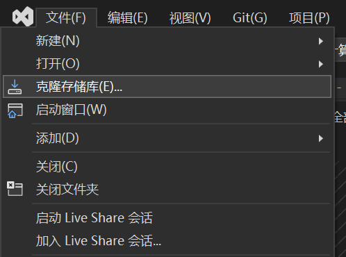
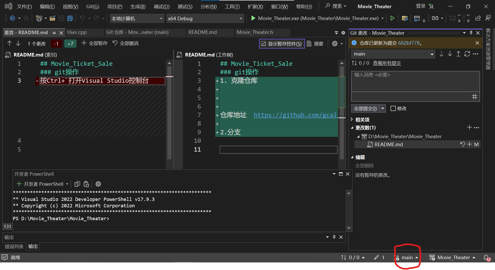
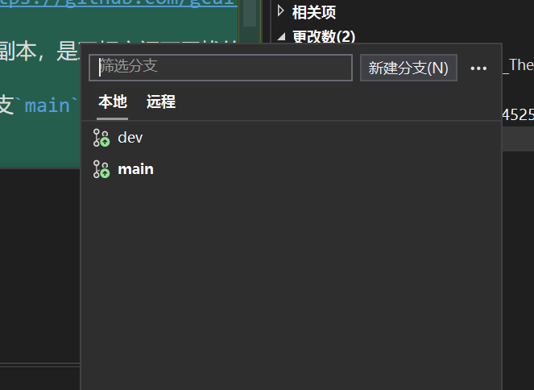
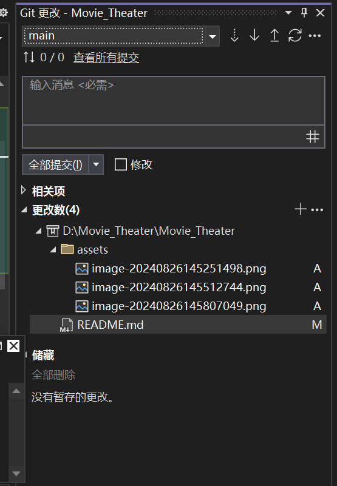
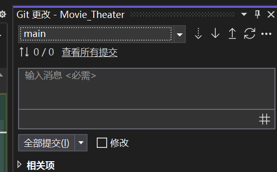

## 操作文档

### git操作
1. 克隆仓库

   

仓库地址  https://github.com/gcaltair/Movie_Ticket_Sale.git

2. 分支：即为副本，是互相之间不干扰的空间

通常有两个分支`main`和`dev`

右下角

`main`分支是正式发行中使用的，在开发中不使用，在开发中使用`dev`分支

点击即可切换到dev分支，切换后，一切代码的修改就都会在dev分支中进行。

3. 更改项目

即为在本机中更改的项目，可以是增加、修改、删除等。点击提交后，修改后的文件会被提交到本地仓库，随后

点击上传按钮，会被上传到github，这时便完成了一次上传

4. 合并分支（不需要写入文档了吧

----

### 测试

使用`test1.cpp`测试写过的类

https://www.bilibili.com/video/BV1UP411P7Ed/?spm_id_from=333.337.search-card.all.click&vd_source=48967c9da100242a790cef3ee3c6d53c

### 思考

gc:增加选座位功能？
